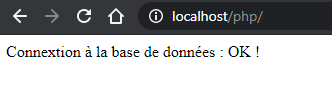

# Bibliotheque type CRUD

## Install

1. Open Terminal window 
2. mysql -u db-user -p < bibliotheque.sql
3. git clone https://github.com/Frodenils/php-bd-bibliotheque.git
4. rename conf.sample.php to conf.php
5. update conf.php with your parameters
6. php -S localhost:8000
7. Open http with your browser